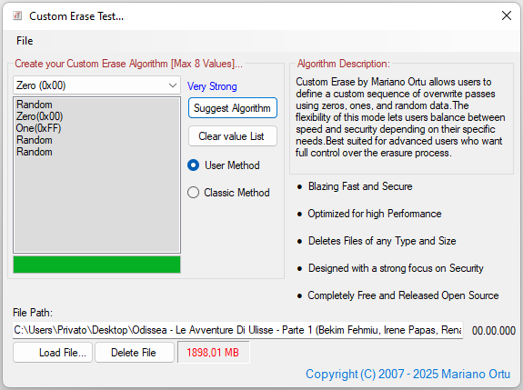

# 🔥 Custom Erase - Secure File Deletion Algorithm 🔥

  
  

---

## 🚀 Overview

**Custom Erase** is a secure file deletion algorithm designed to permanently erase data on traditional HDDs by overwriting file contents using advanced patterns.

On SSDs, due to wear leveling and internal block remapping, overwrite-based techniques may not guarantee full data removal. In such cases, we recommend using hardware-level Secure Erase commands or vendor-specific tools for guaranteed results..

### What’s inside the box? 🎁

- ✅ Fully documented **C# source code** of the algorithm  
- ✅ Visual Studio project to build the **CustomEraser.dll**  
- ✅ A sleek sample app (**CustomTest**) showing how to securely erase any file  
- ✅ Built-in **SHA-256 hash** verification & **PGP digital signatures** for rock-solid authenticity  

---

## 🛠️ Build Instructions

### Prerequisites

- Visual Studio 2019 or newer  
- .NET Framework 4.8  

### How to build it?

1. Unzip `CustomEraserdll.zip`.  
2. Open `CustomEraser.csproj` in Visual Studio.  
3. Build in **Release** mode.  
4. Find your `CustomEraser.dll` in `bin\Release`.  

---

## 💻 Usage Example

Check out the **CustomTest** demo app that shows:

- How to reference the DLL in your C# projects  
- Passing a file path to securely erase it  
- Handling success or failure notifications  

---

## 🖼️ Screenshot

---

## 🔒 Security & Verification

Every official release includes:

- `.sig` file with the PGP digital signature  
- `.sha256` checksum file  

Verify your downloads for guaranteed **integrity & authenticity**.

---

## 📜 License

Licensed under the **GNU GPL v3.0 or later** — see the [LICENSE](LICENSE) file for details.

---

## 📥 Download

Grab the full package here:  
[https://github.com/Mariano-28/CustomEraseAlgorithm](https://github.com/Mariano-28/CustomEraseAlgorithm)

---

## 📞 Contact

**Mariano Ortu**  
🌐 [sicurpas.it](https://www.sicurpas.it)  
📧 sicurpas@sicurpas.it  

> *"Secure erasure is a right for those who work with responsibility. Custom Erase guarantees that right."*

---

*Thank you for trusting Custom Erase!* 🚀✨
